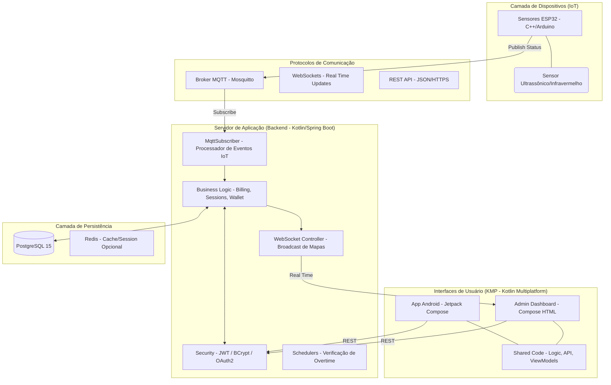
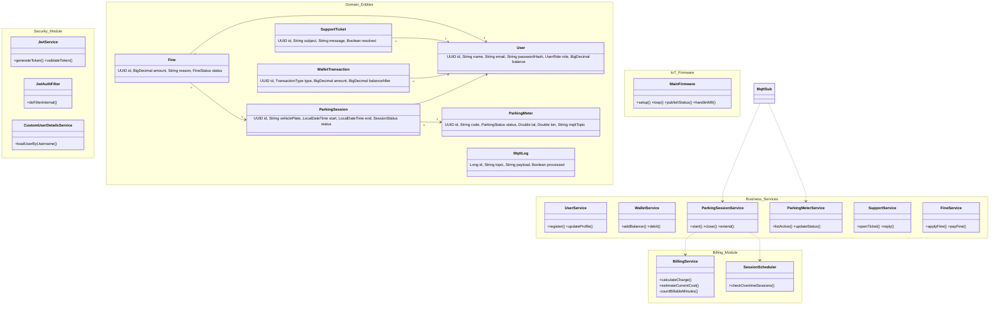
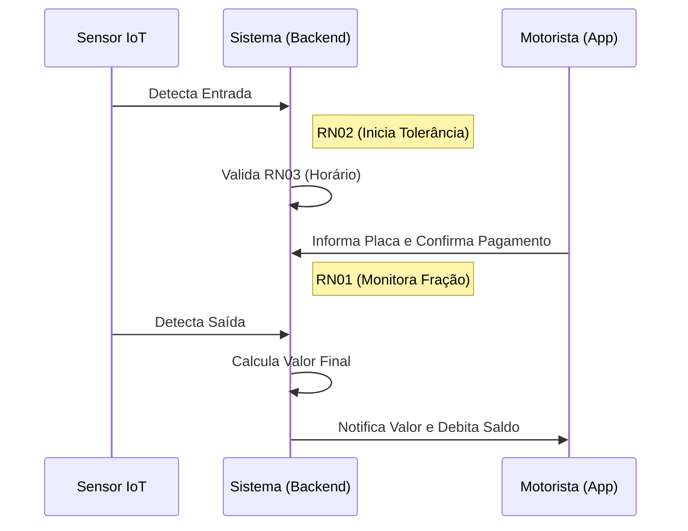
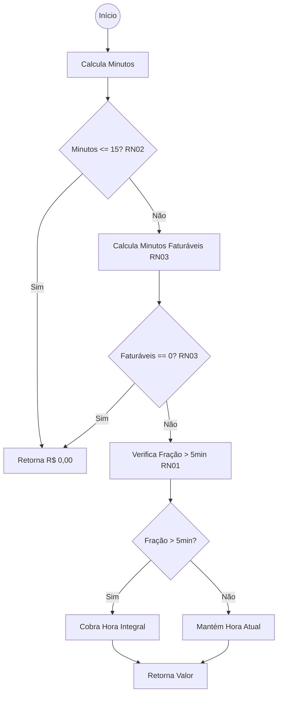
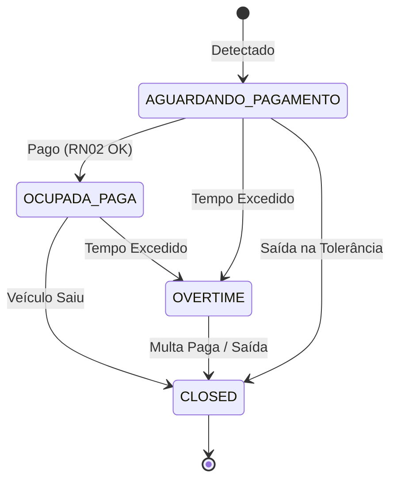

# Projeto Interdisciplinar – Plano de Teste de Software

---

## Grupo 1: Especificação e Arquitetura do Software

### 1. Descrição Textual do Caso de Uso (Quadro 1a)
**Caso de Uso:** Gerenciar Ocupação e Tarifação Inteligente  
**Descrição:** O sistema monitora vagas de estacionamento rotativo por meio de sensores IoT. Ao detectar um veículo, inicia o fluxo de cobrança com período de tolerância, tarifas configuradas e fiscalização automática.  
**Ator Primário:** Sensor IoT  
**Atores Secundários:** Motorista, Fiscal de Trânsito

| Seção | Descrição |
| :--- | :--- |
| **Precondições** | PC01: A vaga está registrada com status inicial LIVRE.  PC02: Tabela de tarifas e horário de funcionamento configurados. |
| **Fluxo Principal** | 1. Sensor detecta entrada e envia "Carro Detectado" (MQTT). 2. Sistema confirma Horário Comercial (RN03). 3. Sistema altera status para AGUARDANDO_PAGAMENTO. 4. Sistema inicia Tolerância de 15 min (RN02). 5. Motorista abre app, insere placa e paga 1 hora. 6. Sistema altera status para OCUPADA_PAGA. 7. Sensor detecta saída e sistema encerra sessão (LIVRE). |
| **Fluxos Alternativos** | A1: Tolerância Expirada sem Pagamento (Status OVERTIME). A2: Veículo Fora do Horário Comercial (Custo R$ 0,00). A3: Extensão de Tempo via App. |
| **Fluxos de Exceção** | E1: Falha na comunicação MQTT (Log de erro). E2: Falha no processamento do Pagamento. |
| **Pós-condições** | Vaga retorna a LIVRE e registros financeiros/infrações salvos no banco. |

**Regras de Negócio (RN):**
* **RN01 - Tarifação por Hora Cheia:** Tarifa de R$ 2,00/h. Após 5 min de fração, cobra hora integral (ex: 1h 06min = R$ 4,00).
* **RN02 - Tolerância Inicial:** Período gratuito de 15 min. Status "AGUARDANDO_PAGAMENTO".
* **RN03 - Horário Comercial:** Seg-Sex (08h-18h), Sáb (08h-13h). Fora disso: R$ 0,00.

### 2. Diagrama Arquitetural Completo
A arquitetura do PontoLivre é baseada em uma pilha tecnológica moderna e distribuída, integrando hardware, serviços de nuvem e aplicações multiplataforma.

### 3. Diagrama de Classes Completo
Mapeamento de toda a estrutura lógica do sistema, incluindo serviços de segurança, regras de negócio e persistência.

---

## Grupo 2: Modelagem e Projeto dos Casos de Teste

### 4. Diagrama de Atividades e GFC

#### Diagrama de Atividades (Swimlanes)

#### Grafo de Fluxo de Controle (GFC)

#### Quadro 2a: Caminhos Independentes do GFC
| # Caminho | Caminho | Arcos Primitivos | Regiões do Grafo |
| :--- | :--- | :--- | :--- |
| **C1** | N1 -> N2 -> D1(Sim) -> EndZero | (N1,N2), (N2,D1), (D1,EndZero) | Região 1 (Tolerância RN02) |
| **C2** | N1 -> N2 -> D1(Não) -> N3 -> D2(Sim) -> EndZero | (N1,N2), (N2,D1), (D1,N3), (N3,D2), (D2,EndZero) | Região 2 (Isenção RN03) |
| **C3** | N1 -> N2 -> D1(Não) -> N3 -> D2(Não) -> N4 -> D3(Não) -> N6 -> EndFinal | (N1,N2), (N2,D1), (D1,N3), (N3,D2), (D2,N4), (N4,D3), (D3,N6), (N6,EndFinal) | Região 3 (Cobrança Base RN01) |
| **C4** | N1 -> N2 -> D1(Não) -> N3 -> D2(Não) -> N4 -> D3(Sim) -> N5 -> EndFinal | (N1,N2), (N2,D1), (D1,N3), (N3,D2), (D2,N4), (N4,D3), (D3,N5), (N5,EndFinal) | Região 4 (Acréscimo Fração RN01) | Região 4 (Acréscimo Fração RN01) |

### 5. Diagrama de Transição e Grafo de Estados (GE)

#### Grafo de Estados (GE)

#### Quadro 2b: Sequências Independentes do GE
| # Sequência | Sequência de Transições | Estados Envolvidos |
| :--- | :--- | :--- |
| **S1** | [*] -> AGUARDANDO_PAGAMENTO -> OCUPADA_PAGA -> CLOSED -> [*] | INÍCIO, AGUARDANDO_PAGAMENTO, OCUPADA_PAGA, CLOSED, FIM |
| **S2** | [*] -> AGUARDANDO_PAGAMENTO -> OVERTIME -> CLOSED -> [*] | INÍCIO, AGUARDANDO_PAGAMENTO, OVERTIME, CLOSED, FIM |
| **S3** | [*] -> AGUARDANDO_PAGAMENTO -> CLOSED -> [*] | INÍCIO, AGUARDANDO_PAGAMENTO, CLOSED, FIM |
| **S4** | [*] -> AGUARDANDO_PAGAMENTO -> OCUPADA_PAGA -> OVERTIME -> CLOSED -> [*] | INÍCIO, AGUARDANDO_PAGAMENTO, OCUPADA_PAGA, OVERTIME, CLOSED, FIM |

### 6. Matriz de Casos de Teste (Quadro 2c)
| # CT | Cenário | Caminho GFC | Seq. GE | Condição Entrada “RN01” | Condição Entrada “RN02” | Condição Entrada “RN03” | Saída Esperada |
| :--- | :--- | :--- | :--- | :--- | :--- | :--- | :--- |
| **CT01** | Fluxo Principal | **C1** | **S3** | N/A | 10 min (<= 15 min) | Comercial | R$ 0,00 e CLOSED |
| **CT02** | Cobrança 1h | **C3** | **S1** | 20 min (<= 1h + 5m) | > 15 min | Comercial | R$ 2,00 e CLOSED |
| **CT03** | Cobrança 2h | **C4** | **S1** | 66 min (> 1h + 5m) | > 15 min | Comercial | R$ 4,00 e CLOSED |
| **CT04** | Domingo | **C2** | **S1** | N/A | > 15 min | Domingo | R$ 0,00 e CLOSED |
| **CT05** | Inadimplência| **C3** | **S2** | N/A | Expirada | Comercial | OVERTIME |
| **CT06** | Saída Tolerância| **C1** | **S3** | N/A | 12 min (Dentro) | Comercial | R$ 0,00 e CLOSED |
| **CT07** | Excesso Tempo | **C3** | **S4** | 125 min (> 2h) | Excedida | Comercial | OVERTIME (Pós-pago) |

---

## Grupo 3: Implementação e Execução (Unidade)

### 7. Implementação (Links GitHub)
👉 [Código BillingServiceTest.kt](https://github.com/usuario/ponto-livre/backend/src/test/kotlin/com/smartparking/service/BillingServiceTest.kt)

### 8. Execução e Cobertura (Relatório JaCoCo)
👉 [Relatório de Cobertura JaCoCo](https://github.com/usuario/ponto-livre/reports/coverage)

---

## Grupo 4: Execução dos Testes de Sistema

### 9. Planilha de Testes e Vídeo
👉 [Planilha de Testes de Sistema](https://docs.google.com/spreadsheets/...)  
👉 [Vídeo de Execução (YouTube)](https://youtube.com/...)

---

## Grupo 5: Resumo do Plano de Teste (Quadro 5a)

| Etapas | Técnica: Funcional – Caixa Preta | Técnica: Estrutural – Caixa Branca |
| :--- | :--- | :--- |
| **Planejamento** | Foco na jornada do motorista e RNs de tarifação. | Foco na lógica de precisão do BillingService. |
| **Projeto** | Critérios: Valores Limite e Transição de Estados. | Critérios: Fluxo de Controle e Cobertura de Caminhos. |
| **Execução** | Procedimento: Manual via App Android e Sensores. | Procedimento: Automatizada via JUnit 5. |
| **Análise** | Verificação de logs e persistência financeira. | Análise de Cobertura via JaCoCo. |

---

## Grupo 6: Apresentação
👉 [Vídeo de Apresentação (20 min)](https://youtube.com/...)
