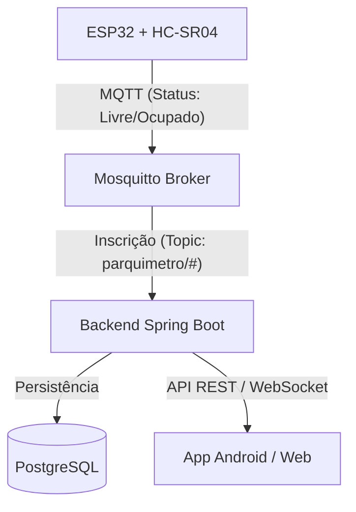

# PontoLivre — Sistema de Estacionamento Inteligente

Bem-vindo ao **PontoLivre**, uma solução completa de IoT para gestão de estacionamentos. Este projeto integra hardware (ESP32), comunicação em tempo real (MQTT), um backend robusto (Spring Boot) e interfaces multiplataforma (Kotlin Multiplatform).

---

## Arquitetura do Sistema

O fluxo de dados do projeto segue esta estrutura:



---

## Pré-requisitos

Antes de começar, certifique-se de ter instalado:
- **Docker & Docker Compose** (Recomendado para facilitar o setup)
- **JDK 17** (Para o Backend)
- **Android Studio** (Para o App Android)
- **VS Code + PlatformIO** (Para o Firmware do ESP32)

---

## Guia de Execução Passo a Passo

### 1. Infraestrutura (Banco de Dados e Broker MQTT)
A maneira mais fácil de iniciar a infraestrutura é usando o Docker. Isso subirá o banco de dados PostgreSQL e o Broker Mosquitto com todas as configurações necessárias.

```bash
cd infra
docker compose up -d
```
> **O que isso faz?**
> - Inicia o **PostgreSQL** e já executa o script `init.sql` (cria tabelas e insere dados iniciais).
> - Inicia o **Mosquitto MQTT**, permitindo que o ESP32 e o Backend se comuniquem.

---

### 2. Backend (Spring Boot)
O backend gerencia a lógica de cobrança, usuários e sessões.

1.  **Configuração:** Verifique o arquivo `backend/src/main/resources/application.yml`. As credenciais padrão já coincidem com as do Docker.
2.  **Execução:** Na raiz do projeto, execute:
    ```bash
    ./gradlew :backend:bootRun
    ```
    O servidor estará disponível em `http://localhost:8080`.

---

### 3. Firmware (ESP32)
O firmware detecta a presença de veículos e envia via MQTT.

1.  Abra a pasta `esp32_firmware` no VS Code com a extensão **PlatformIO**.
2.  Edite `src/config.h` com suas credenciais:
    ```cpp
    #define WIFI_SSID       "NOME_DO_SEU_WIFI"
    #define WIFI_PASSWORD   "SUA_SENHA"
    #define MQTT_BROKER     "IP_DO_SEU_PC" // O IP da sua máquina na rede local
    ```
3.  Conecte o ESP32 e clique em **Upload** no PlatformIO.

#### Conexões de Hardware (Esquema)
| ESP32 Pin | Componente | Pino do Componente |
| :--- | :--- | :--- |
| GPIO 5 | Sensor HC-SR04 | TRIG |
| GPIO 18 | Sensor HC-SR04 | ECHO |
| GPIO 21 | Display OLED | SDA |
| GPIO 22 | Display OLED | SCL |
| 3.3V / GND | Todos | VCC / GND |

---

### 4. Frontend (Android e Web)
O projeto usa Kotlin Multiplatform para compartilhar lógica entre plataformas.

-   **Android:**
    1. Abra o projeto no Android Studio.
    2. **Mapa:** O projeto utiliza o **MapLibre** (Open Source), que é 100% gratuito e não exige chave de API do Google.
    3. Execute o módulo `:frontend_kmp:androidApp`.
    > *Nota: Se usar o emulador, o IP do backend é `http://10.0.2.2:8080`.*

-   **Web:**
    1. Execute o comando abaixo no terminal:
    ```bash
    ./gradlew clean
    
    ./gradlew :frontend_kmp:webApp:jsBrowserDevelopmentRun
    
    
  

    ```    

    O site abrirá em `http://localhost:3000`.

---

## Simulando Sem Hardware
Você pode testar o sistema completo mesmo sem um ESP32 físico, simulando mensagens MQTT.

1.  **Ocupar Vaga (PKM-001):**
    ```bash
    docker exec -it pontolivre_mosquitto mosquitto_pub -t "parquimetro/PKM-001/status" -m "Ocupado"
    ```
2.  **Liberar Vaga (Fim da Sessão):**
    ```bash
    docker exec -it pontolivre_mosquitto mosquitto_pub -t "parquimetro/PKM-001/status" -m "Livre"
    ```

---

## Usuários para Teste

| Email | Senha | Perfil |
| :--- | :--- | :--- |
| `admin@pontolivre.com` | `Admin@123` | Administrador |
| `joao@email.com` | `User@123` | Usuário Comum |

---

## Regras de Negócio Implementadas

- **Tolerância:** Primeiros 15 minutos são gratuitos.
- **Tarifa:** R$ 2,00 por hora (cobrança por hora cheia).
- **Horário:** Cobrança apenas em horário comercial (Seg-Sex 08-18h, Sáb 08-13h).
- **Multa:** Exceder o limite de 2 horas gera multa automática.
- **Carteira:** O usuário deve ter saldo para iniciar a sessão ou o valor será descontado após a liberação da vaga.

---

Para mais detalhes técnicos, consulte `infra/SETUP_INSTRUCTIONS.md`.


Testes:


```bash
./gradlew :backend:test --tests "com.smartparking.service.BillingServiceTest"
```
```bash
./gradlew :backend:test :backend:jacocoTestReport
```
